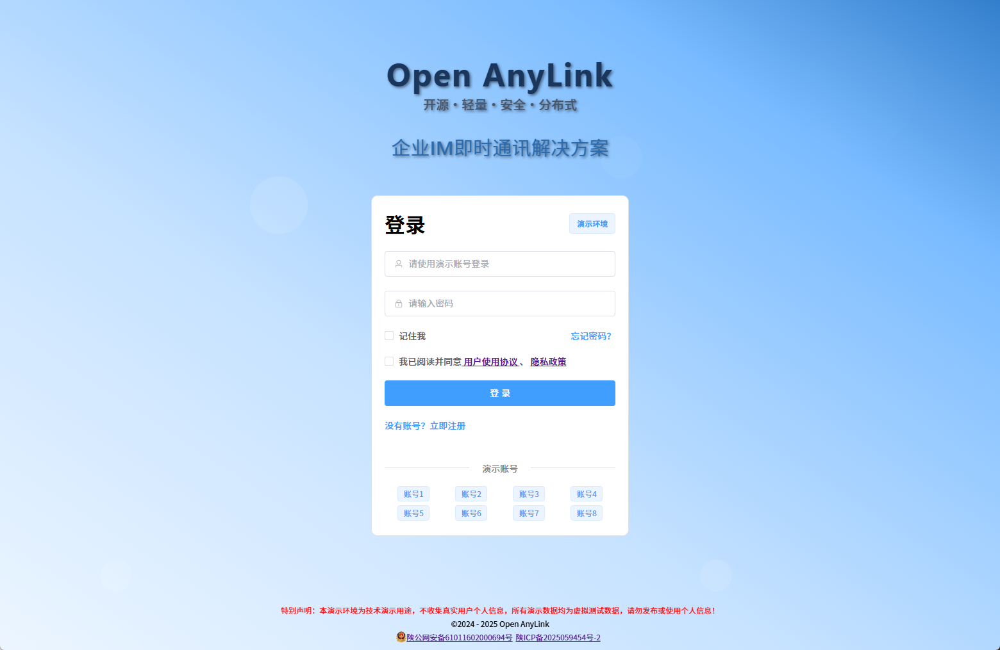
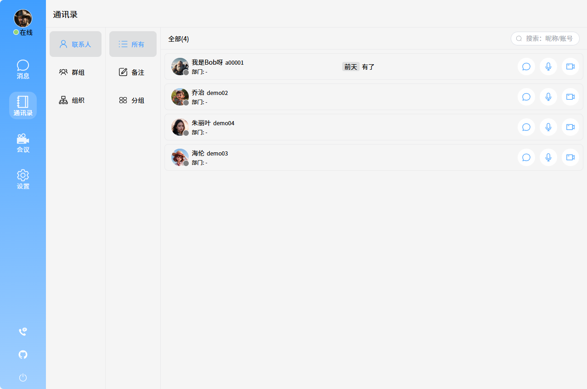
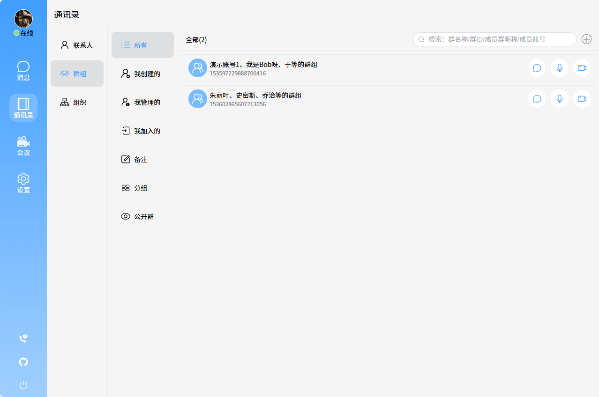
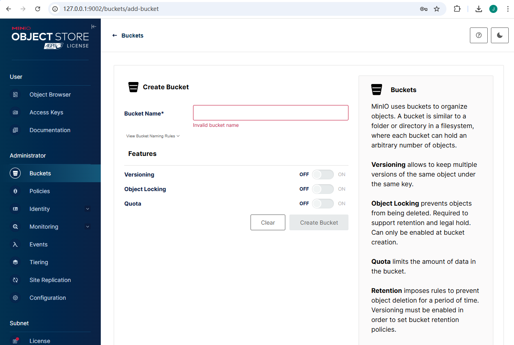
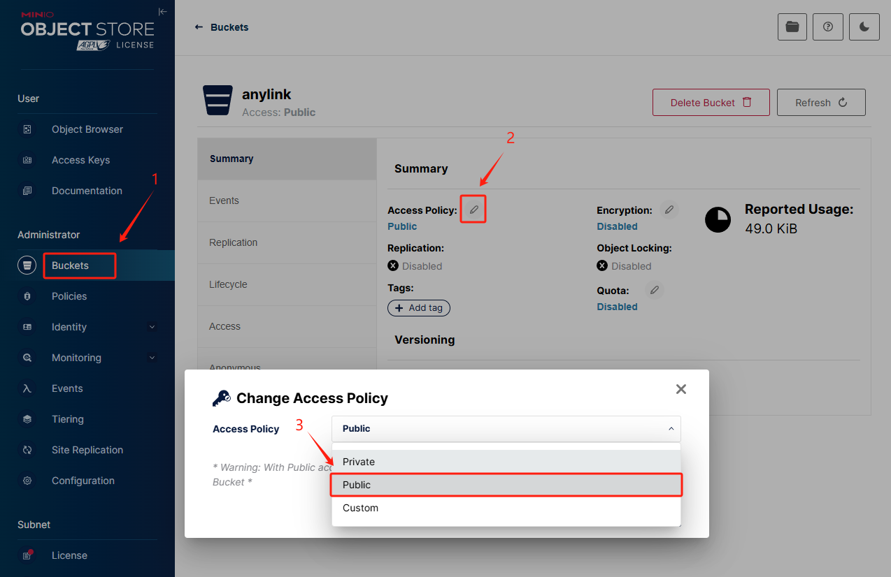
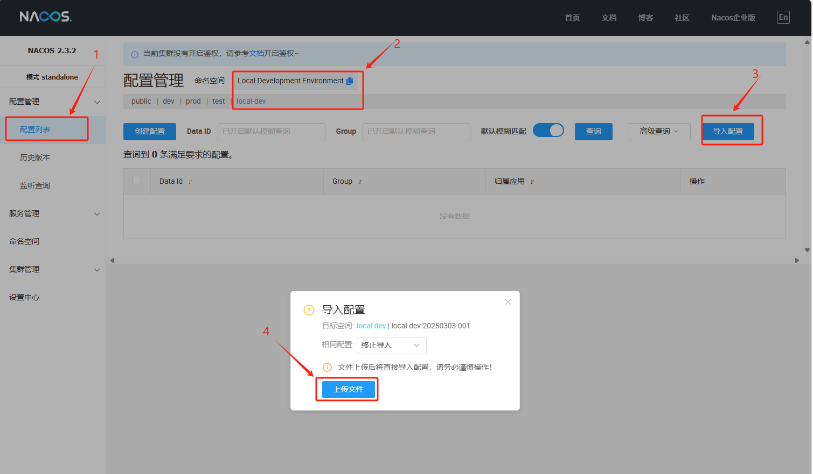
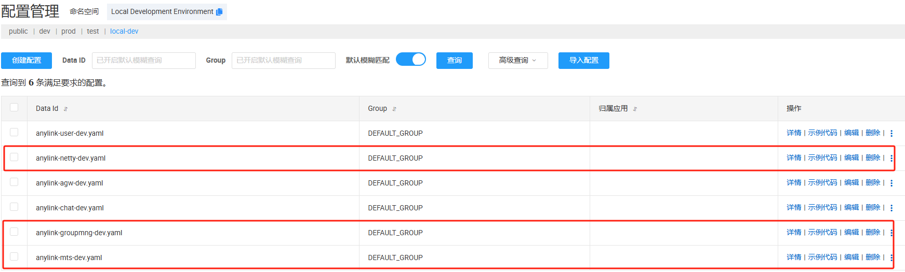
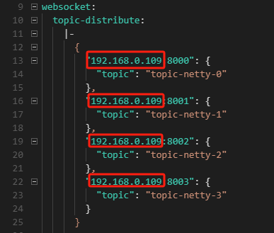

<style>
.logo {
  font-family: 'Segoe UI', system-ui, sans-serif;; 
  font-size: 80px;
  font-weight: bold;
  color: #1a365d;
  display: block;
  text-align: center;
  text-shadow: 2px 2px 4px rgba(0, 0, 0, 0.5);
}
</style>
<span class="logo">Open AnyLink</span>


## 简介
- Open AnyLink是一款面向企业的IM即时通讯解决方案，旨在帮助企业`低成本`、`高效率`地构建`私有`、`安全`、`分布式`、`可定制`的日常办公通讯工具。

## 项目构成
| 项目  | 项目名              | 地址                                                                                                                                                                                                                                                                                                                                                      | 技术栈                                                                                                                                                                                                                                              |
|-----|------------------|---------------------------------------------------------------------------------------------------------------------------------------------------------------------------------------------------------------------------------------------------------------------------------------------------------------------------------------------------------|--------------------------------------------------------------------------------------------------------------------------------------------------------------------------------------------------------------------------------------------------|
| Web端 | open-anylink-web | <a :href="https://github.com/GatlinHa/open-anylink-web" target="_blank">github</a>: <br/><a :href="https://gitee.com/lijingbo-2021/open-anylink-web" target="_blank">gitee</a>:  | 框架：`Vue3`<br/> 构建打包：`Vite` <br/>UI组件：`Element-Plus`                                                                                                                                                                                              |
| 服务端 | open-anylink     | <a :href="https://github.com/GatlinHa/open-anylink" target="_blank">github</a>: <br/><a :href="https://gitee.com/lijingbo-2021/open-anylink" target="_blank">gitee</a>:  | 框架：`spring Boot` `spring cloud`<br/>长连接：`Netty`<br/>私有协议：`protobuf`<br/>配置中心：`Nacos Config`<br/>注册中心：`Nacos Discovery`<br/>关系型数据库：`MySQL` `MyBatis-Plus`(driver)<br/>非关系型数据库：`MongoDB`<br/>缓存：`Redis`<br/>消息队列：`Kafka MQ` <br/>对象存储：`Mino` `OSS` |
- 本项目是其中的`服务端`。

## 更新记录
- xx/xx/xx: V1.0.0发布，基本功能见`项目功能清单`

## 项目功能清单（含规划及开发中）
| 功能大类  | 功能小类                                                                                                                                                                                                                                                                                                                                                                                                                                                                                                                                                     |
|-------|--------------------------------------------------------------------------------------------------------------------------------------------------------------------------------------------------------------------------------------------------------------------------------------------------------------------------------------------------------------------------------------------------------------------------------------------------------------------------------------------------------------------------------------------------------|
| 聊天类型  | <input type="checkbox" checked>单聊</input><br/><input type="checkbox" checked>群聊</input>                                                                                                                                                                                                                                                                                                                                                                                                                                                                |
| 通话功能  | <input type="checkbox" unchecked>语音通话</input><br/><input type="checkbox" unchecked>视频通话</input>                                                                                                                                                                                                                                                                                                                                                                                                                                                        |
| 消息类型  | <input type="checkbox" checked>文本</input><br/><input type="checkbox" checked>表情</input><br/><input type="checkbox" checked>图片</input><br/><input type="checkbox" unchecked>音频</input><br/><input type="checkbox" unchecked>视频</input><br/><input type="checkbox" unchecked>文件</input>                                                                                                                                                                                                                                                                  |
| 消息功能  | <input type="checkbox" checked>在线消息</input><br/><input type="checkbox" checked>离线消息</input><br/><input type="checkbox" checked>消息漫游</input><br/><input type="checkbox" checked>多端在线</input><br/><input type="checkbox" checked>多端同步</input><br/><input type="checkbox" checked>已读未读</input><br/><input type="checkbox" unchecked>历史消息</input><br/><input type="checkbox" unchecked>@消息</input><br/><input type="checkbox" unchecked>消息撤回</input><br/><input type="checkbox" unchecked>消息引用</input><br/><input type="checkbox" unchecked>消息加入待办</input> |
| 群组功能  | <input type="checkbox" checked>建群删群</input><br/><input type="checkbox" checked>群昵称</input><br/><input type="checkbox" checked>群备注</input><br/><input type="checkbox" checked>群头像</input><br/><input type="checkbox" checked>群公告</input><br/><input type="checkbox" checked>群系统消息</input><br/><input type="checkbox" checked>群转让</input><br/><input type="checkbox" unchecked>万人大群</input><br/><input type="checkbox" unchecked>团队组织群</input><br/><input type="checkbox" unchecked>公开群</input>                                                          |
| 通讯录功能 | <input type="checkbox" checked>联系人备注</input><br/><input type="checkbox" checked>联系人分组</input><br/><input type="checkbox" checked>群备注</input><br/><input type="checkbox" checked>群分组</input><br/><input type="checkbox" unchecked>组织管理</input>                                                                                                                                                                                                                                                                                                          |
| 会议功能  | <input type="checkbox" unchecked>语音会议</input><br/><input type="checkbox" unchecked>视频会议</input><br/><input type="checkbox" unchecked>桌面共享</input><br/><input type="checkbox" unchecked>桌面远程操控</input><br/><input type="checkbox" unchecked>会议录制</input><br/><input type="checkbox" unchecked>会议预约</input>                                                                                                                                                                                                                                              |
| AI接入  | <input type="checkbox" unchecked>个人知识库</input><br/><input type="checkbox" unchecked>聊天机器人</input><br/><input type="checkbox" unchecked>AI Agent</input><br/><input type="checkbox" unchecked>聊天内容审核</input><br/><input type="checkbox" unchecked>企业培训培养</input>                                                                                                                                                                                                                                                                                        |
| 其他功能  | <input type="checkbox" unchecked>大文件传输</input><br/><input type="checkbox" unchecked>待办事项</input>                                                                                                                                                                                                                                                                                                                                                                                                                                                       |
                                                                                                                                                                                                                                                                                                                                                                                                                                                               |

## 项目演示地址
- https://open-anylink.com/login

## 项目预览









## 项目安装运行
### Web端
```shell
# 克隆项目: github
git clone https://github.com/GatlinHa/open-anylink-web.git
# 克隆项目: gitee
git clone https://gitee.com/lijingbo-2021/open-anylink-web.git
  
# 进入项目根目录，执行安装依赖
pnpm install

# 开发环境本地运行
pnpm dev

# 编译生产环境版本
pnpm build:prod
```

### 服务端
#### 拷贝项目
```shell
# 克隆项目: github
git clone https://github.com/GatlinHa/open-anylink.git
# 克隆项目: gitee
git clone https://gitee.com/lijingbo-2021/open-anylink.git
```

#### 安装Minio
- 安装过程详见官网指导：https://min.io/download?view=aistor
- 启动Minio：在安装目录根目录下创建一个bat文件，然后执行启动
  ```shell
  set MINIO_ACCESS_KEY=admin # 用户名
  set MINIO_SECRET_KEY=12345678 # 密码
  .\exe\minio.exe  server .\data --address ":9001" --console-address ":9002"
  ```
- 登录minio：http://127.0.0.1:9002/buckets ， 账号：admin，密码：12345678
- 创建一个bucket，Name填：anylink
  
- 修改bucket的读取权限
  

#### 安装MySQL
- 安装MySQL Server社区版8.x:  https://dev.mysql.com/downloads/, 详细安装过程请查看官方文档。
- 注意：nacos的jdbc配置为：localhost:3306，用户名密码是：root/123456，如果安装不一致，请修改nacos配置。
- 创建一个叫`anylink`的db
  ```sql
  CREATE DATABASE anylink
  CHARACTER SET utf8mb4
  COLLATE utf8mb4_0900_ai_ci;
  ```
- 创建表，分别执行sql文件中的建表语句：
  - [anylink-groupmng/src/main/resources/db/mysql.sql](anylink-groupmng/src/main/resources/db/mysql.sql)
  - [anylink-chat/src/main/resources/db/mysql.sql](anylink-chat/src/main/resources/db/mysql.sql)
  - [anylink-mts/src/main/resources/db/mysql.sql](anylink-mts/src/main/resources/db/mysql.sql)
  - [anylink-user/src/main/resources/db/mysql.sql](anylink-user/src/main/resources/db/mysql.sql)

#### 安装Redis
- 下载安装包：https://github.com/tporadowski/redis/releases, 安装过程详见官网文档。
- 注意：请使用默认端口，无密码，如不一致，请同步修改nacos配置。

#### 安装Kafka MQ
- 下载安装包：https://kafka.apache.org/downloads, 安装过程详见官网文档。
- 安装后进入到目录：`kafka\bin\windows` 下，先启动zookeeper服务，再启动kafka服务
  ```shell
  #要先启动zookeeper服务
  ./zookeeper-server-start.bat ../../config/zookeeper.properties
  # 再启动kafka服务
  ./kafka-server-start.bat ../../config/server.properties
  ```
  
#### 安装MongoDB
- 安装过程详见官方文档：https://www.mongodb.com/zh-cn/docs/manual/administration/install-community/
- 注意：请使用默认端口，无密码，如不一致，请同步修改nacos配置。

#### 安装Nacos
- 安装过程详见官网指导：https://nacos.io/docs/next/quickstart/quick-start/
- 本地以standalone单机模式启动
  ```shell
  startup.cmd -m standalone
  ```
- 创建命名空间
  ```shell
  curl -d 'namespaceId=local-dev-20250303-001' -d 'namespaceName=local-dev' -d 'namespaceDesc=Local Development Environment' -X POST 'http://127.0.0.1:8848/nacos/v2/console/namespace'
  ```
- 浏览器登录nacos： http://127.0.0.1:8848/nacos
- 导入配置，配置文件在：[doc/config/nacos/nacos_config_export_20250303110546.zip](doc/config/nacos/nacos_config_export_20250303110546.zip)


- 修改个别配置项：修改这三个配置文件中关于本地IP的配置，改成自己的192.168网段的本地IP，修改完后记得点击`发布`。



## 开源项目免责声明
1. **项目性质与保证范围**：本 开源项目由本作者开发并在 GitHub 上开源发布，旨在为用户提供面向企业的IM即时通讯解决方案。在法律允许的最大限度内，开发者不对软件的功能性、安全性、适用性作出任何形式的明示或暗示保证，包括但不限于软件无错误、能持续正常运行或完全适配用户特定环境等。
2. **使用风险承担**：用户明确知悉并同意，使用本软件的全部风险由用户自行承担。软件以 “现状” 及 “现有” 基础提供，不存在任何开发者额外承诺的质量保障或性能优化。开发者不提供任何明示或暗示担保，诸如适销性、适合特定用途以及不侵权等方面的担保。
3. **责任限制**：无论基于何种法律理论（包括但不限于合同、侵权、疏忽等），在任何情形下，开发者及其关联方、供应商均不对因使用本软件所引发的任何直接、间接、偶然、特殊、惩罚性或后果性损害负责，包括但不限于利润损失、业务中断、数据丢失、个人信息泄露或其他商业损害、损失。
4. **二次开发与合规责任**：针对基于本项目进行二次开发的用户，需确保将本软件及衍生作品用于合法目的，并自行负责遵循当地法律法规。因二次开发或使用过程中违反法律规定而产生的一切责任、纠纷，均由二次开发者承担，与开发者无关。
5. **项目变更权利**：开发者保留在任何时间对软件功能、特性进行修改的权利，同时有权修订本免责声明的任何部分。此类修改可能通过软件更新、项目文档更新等形式呈现。用户在软件更新或持续使用项目相关内容时，应及时查看并视作接受最新版本的免责声明及软件变更。
6. 请用户仔细阅读并充分理解本免责声明。一旦使用本开源项目，即表明用户已接受本免责声明的全部条款。
7. 该免责声明的最终解释权归开发者所有。

## 交流社群


## 如何联系我们
- **QQ**：312777916
- **邮箱**：312777916@qq.com
- **微信**：wx_open_anylink_2025


### 最后，如果您觉得还不错，请 `Star`, `Fork`一下本项目，或者“请”作者喝一杯coffee，您的一次小小鼓励将会使我们前进很远远。


**感谢以下赞助者的支持**

  | 赞助时间 | 赞助者 | 平台 | 金额 |
  | ---- | ---- | ---- | ---- |
  |  |  |  |
